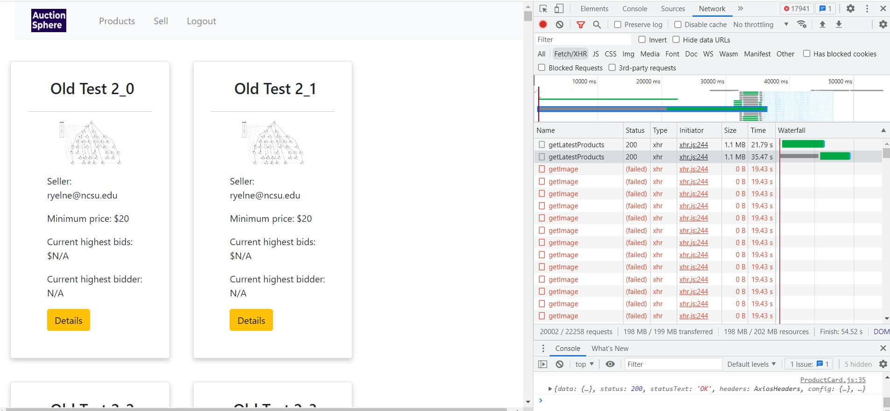
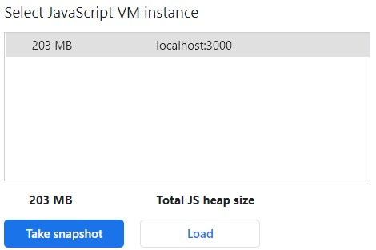
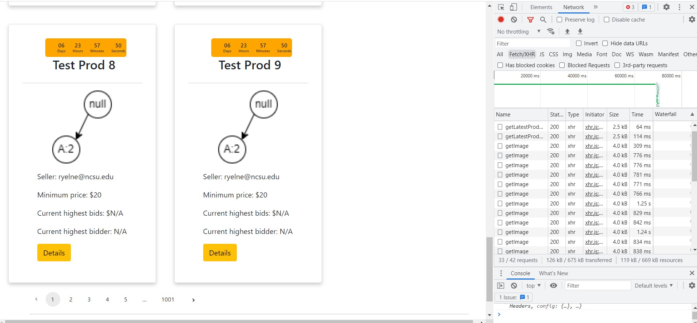
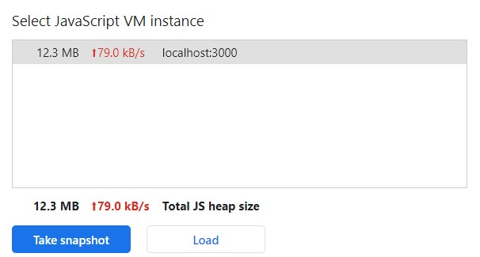

# Auction-Sphere

Repository for CSC 510 Software Engineering project 2, created by Group 14: Mithil Dani, Neha Kale, Rishikesh Yelne, Ritwik Vaidya, Vansh Mehta and Pradyumna Khawas

Click on the image below to view the demo video of the project

## About Auction-Sphere

Want to sell something you own in a bidding war? Want to snatch something you really want?
Congratulations, you have come to the perfect place: the **Auction Sphere**

Auction Sphere is an auctioning system where people can bid on exciting items and also put items up for sale. Every item has a bidding window, and the item goes to the highest bidder by the end of that window.

On the products page, people can view all the latest items being put up for sale and their respective highest bids. On the product details page, apart from product details, people can view the latest bids as well as the highest bid, and can also place a bid. It's upto the seller to decide the minimum price of the product, as well as bid increments.

## Built with
   React.js
   
   JavaScript
   
   Flask
   
   Python
   
   PostgreSQL

## Project documentation
The `docs` folder incorporates all necessary documents and documentation in our project.
## Tools used

Code formatter: Prettier

Tech stack: React.js, Flask, PostgreSQL

## To run our React application

You will need Node.js and NPM installed. You can refer this article if not installed already: https://kinsta.com/blog/how-to-install-node-js/
First, navigate to our application on the terminal and install all the packages using
`npm i`
In case this throws any error, install the yarn package manager:
`npm install --global yarn`
And then to install all the packages, run
`yarn`
Now, to run our application, run
`npm start`
### Code coverage
#### Code coverage in React app (frontend):
To run code coverage, just do:
`yarn coverage`
This will not only give you a detailed report on your terminal, but will also generate a .html file for the reporrt as seen here in our project:
https://github.com/kartikson1/Auction-Sphere/blob/main/coverage/lcov-report/index.html
## Roadmap
We have a lot planned for the future! Completed tasks and future enhancements can be found [here](https://github.com/users/kartikson1/projects/1/views/1)

## Improvements

We have focused on multiple aspects to improve the project, following are few aspects which we have enhanced:

### 1. Performance
In the first phase of the project, the products were listed on the webpage by fetching all available products in the database. This is not a **scalable** option. If we add about 10000 products in the database, the performance of the application will be drastically affected. 
Following is the screenshot of the network and memory tabs of the browser while loading 10000 records form the database:

The API endpoint requires ~35 seconds to fetch all records and the size of the packet is over 1Mb. 

Browser Memory Consumption: 

**The Fix : Pagination**

We have implemented a paginated endpoint to fetch only 10 records at a time and the user can traverse through the pages using a pagination component. This drastically reduces the loading time of the page and also requires lower packet size to be transferred over the network.

Following is the screenshot of the network and memory tabs of the browser while loading 10000 records form the database:

With the paginated API endpoint, it requires only 114ms to fetch 10 records and the size of the packet is a mere 2.5kB. 

Browser Memory Consumption: 

In comparison, following are the improvement metrics in terms of Performance:

Metric | Before | After | Improvement % 
-- | -- | -- | --
Time | 35 seconds | 114 ms | 300x better  
Size | 1.1Mb | 2.5kB | 440x better 
Memory | 203Mb | 12.3Mb | 16x better

### 2. Caching

## Group-14

[Mithil Dani](https://github.com/mithildani)

[Neha Kale](https://github.com/nehakale8)

[Rishikesh Yelne](https://github.com/rishikesh-yelne)

[Ritwik Vaidya](https://github.com/ritwik4690)

[Vansh Mehta](https://github.com/vanshmehta-7)

[Pradyumna Khawas](https://github.com/therealppk)
